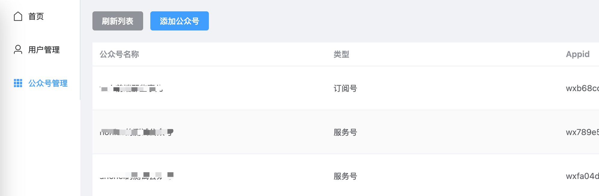
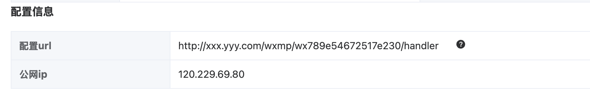

# **微信公众号管理系统**

## 背景

微信公众号官方提供了各种 api 用来管理公众号的资源，例如素材管理、用户管理等。同时支持配置「服务器地址」用来接管公众号的消息推送。该项目可实现这些功能。

体验 demo：[http://wechat.anchel.cn](http://wechat.anchel.cn/)

账号密码：guest/guest

## **已实现功能**

1. 多公众号管理
2. 接收消息（明文、密文）
3. 回复消息（文字、图片、音频、视频、图文（外链））
4. 自定义菜单（含个性化菜单）
5. 素材管理（图片、音频、视频）
6. 二维码（永久、临时）
7. 用户管理（标签新增、标签删除、设置用户标签、设置用户备注）

### 提示

微信公众号官方管理后台(mp.weixin.qq.com)的功能完整、体验良好。一般情况不建议部署自己的管理系统，毕竟功能、体验与官方管理系统相比还是有所损失。

## 技术架构

前后端分离的形式，分为两个项目

- 后端采用 golang+mongodb+redis，即本项目
- 前端用 vue3+element-plus，项目地址：https://github.com/anchel/wechat-official-account-admin-fe

前端项目以 git submodule 的形式，嵌在后端。后端在构建的时候会把前端所有资源一起打包进去，最终就只有一个可执行文件。

## 部署

有两种方式，一种是采用已构建好的可执行文件，另外一种是基于源码手动构建

1. 采用已构建好的可执行文件

   a 在 [下载地址](https://github.com/anchel/wechat-official-account-admin/releases) ，根据自己的服务器类型，下载相应的可执行文件。例如服务器是 linux，cpu 是 amd64，那么就下载 woaa-linux-amd64。为了操作方便，文件重命名为 woaa

   b 把可执行文件 woaa 放到服务器上某个路径，例如 /data/app

   c 在 /data/app 目录下，执行命令：`chmod +x woaa` 这一步是给文件加上可执行权限

   d 把项目源码里面的 .env.example 文件重命名为 .env 并放到 /data/app 目录下，即和 woaa 同一个目录。并根据自己情况把 redis，mongodb 的信息给填上。

   e 在 /data/app 目录下，执行 `./woaa` 即可启动服务

2. 基于源码手动构建

   a 必备工具 git、golang(1.22 以上)、nodejs（20 以上）

   b 克隆项目到本地 `git clone --recurse-submodules https://github.com/anchel/wechat-official-account-admin.git` 此时子项目也会跟着克隆

   c 在项目主目录下，执行 `make fe` 来安装前端的依赖并构建前端产物

   d 执行 `make all` 来构建多平台的目标，执行完成后，会在 build 目录下生成多个平台的可执行文件，根据情况选择合适的。

   e 后续步骤，参考上面第一种方式

## 使用

服务启动之后，默认监听在 9305 端口，假设 ip 是 192.168.0.100

打开浏览器输入地址：http://192.168.0.100:9305

服务首次启动的时候，会自动创建超管用户 admin ，密码是：admin1987 ，可用超管用户登录进去创建其他用户，另外一定要尽快修改超管密码

登录进去之后，默认是没有任何公众号的，需要先添加公众号，步骤如下：

1. 去微信公众号官方后台 [官方后台](https://mp.weixin.qq.com/) 获取 AppID、AppSecret、Token、EncodingAESKey
2. 在该系统的公众号管理页面，添加公众号

   

3. 添加完成之后，查看详情界面可以看到配置地址，这个地址需要配置在微信公众号官方后台。

   

   另外，微信官方会对请求来源 ip 做限制。需要把页面上显示的公网 ip，配置在微信官方的 ip 白名单里面

4. 配置完成后，即可管理公众号了。

## 问题排查

1. 某些接口提示没有权限
   公众号分订阅号，服务号，另外还区分是否已认证，不同类型公众号获取的接口权限列表是不一样的，详情请查看 [接口权限说明](https://developers.weixin.qq.com/doc/offiaccount/Getting_Started/Explanation_of_interface_privileges.html)
2. 请求方的 ip 不在白名单
   需要去微信公众号官方后台，把你服务器的外网 ip 加到白名单里面
